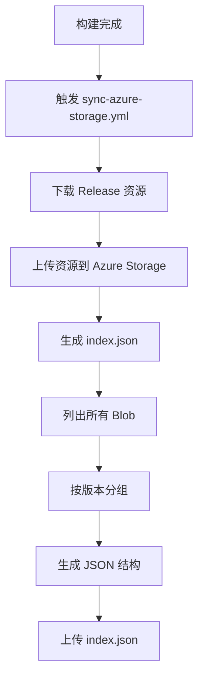
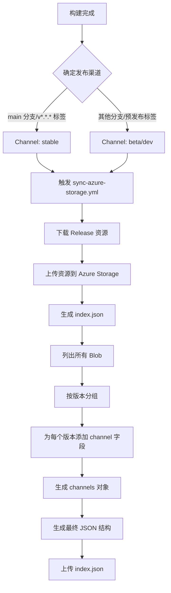

# Change: Desktop 发布流程添加 Channel 渠道标记支持

## Why

Hagicode Desktop 在生成发布版本时，生成的 Azure Index.json 缺少 Channel 渠道标记功能，导致无法区分不同渠道（如 stable、beta、dev）的发布版本。这与 Hagicode Server 的 Index 生成能力不一致，使得版本追踪和管理变得困难。

## What Changes

- **在 CI/CD 构建流程中添加渠道参数支持**
  - 在 GitHub Actions 工作流中支持渠道配置（stable/beta/dev）
  - 根据不同分支或标签自动设置对应渠道

- **修改 index.json 生成逻辑**
  - 在 sync-azure-storage.yml 工作流中修改 index.json 生成脚本
  - 添加 `channels` 字段到 index.json 结构中
  - 确保与 Server 侧的 Index 结构保持一致

- **更新 HTTP Index 源解析**
  - 确认 http-index-source.ts 已支持 channels 字段解析
  - 保持向后兼容性（当 channels 不存在时默认为 beta）

## Code Flow Changes

### 当前 index.json 生成流程



### 改进后的 index.json 生成流程



### index.json 结构变化

**当前结构:**
```json
{
  "updatedAt": "2026-02-15T00:00:00Z",
  "versions": [
    {
      "version": "1.0.0",
      "files": ["hagicode-1.0.0-win-x64.zip"],
      "assets": [...]
    }
  ]
}
```

**改进后结构:**
```json
{
  "updatedAt": "2026-02-15T00:00:00Z",
  "versions": [
    {
      "version": "1.0.0",
      "channel": "stable",
      "files": ["hagicode-1.0.0-win-x64.zip"],
      "assets": [...]
    }
  ],
  "channels": {
    "stable": {
      "latest": "1.0.0",
      "versions": ["1.0.0"]
    },
    "beta": {
      "latest": "0.9.0",
      "versions": ["0.9.0", "0.8.0"]
    }
  }
}
```

## Impact

### Affected specs
- `package-management` - 包管理规范需要支持渠道选择
- `ci-cd` - CI/CD 规范需要更新以支持渠道配置

### Affected code
- `.github/workflows/sync-azure-storage.yml` - 修改 index.json 生成逻辑
- `.github/workflows/build.yml` - 添加渠道参数传递
- `src/main/package-sources/http-index-source.ts` - 已支持 channel 解析（无需修改）

### Migration
- 现有的 index.json 文件向后兼容（channels 字段为可选）
- 未标记渠道的版本将被视为 'beta' 渠道
