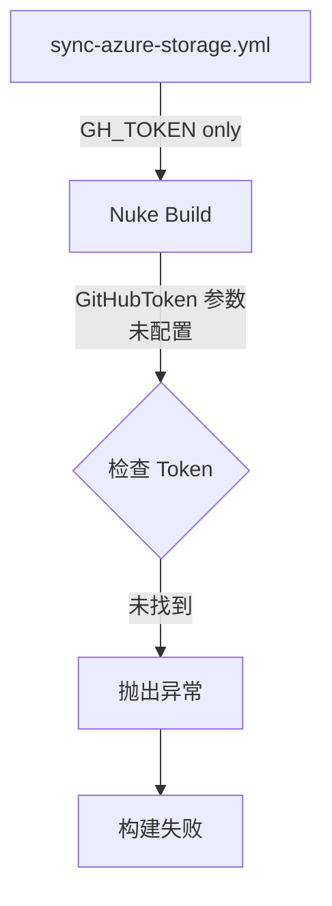

# Change: Fix GitHub Token Configuration for PublishToAzureBlob

## Why

在 CI/CD 构建流程中，`PublishToAzureBlob` 目标执行失败，原因是 GitHub Token 未正确配置。该构建目标需要访问 GitHub Release 资产，但缺少必要的认证凭据。

错误发生在 `nukeBuild/Build.AzureStorage.cs:107`：
```
System.Exception: 必须配置 GitHub Token
```

当前 `sync-azure-storage.yml` 工作流在第 72 行设置了 `GH_TOKEN` 环境变量，但 Nuke 构建脚本需要 `GitHubToken` 参数（PascalCase）。这种命名不一致导致构建脚本无法读取到 GitHub Token。

### 参考实现：hagicode-release 项目

参考 `/home/newbe36524/repos/newbe36524/hagicode-release/` 项目中成熟的 GitHub Token 配置模式：

1. **Nuke 参数定义** (`Build.cs:77-79`):
   ```csharp
   [Parameter("GitHub token for release creation")]
   [Secret]
   readonly string GitHubToken = string.Empty;
   ```

2. **计算属性** (`Build.Partial.cs:100`):
   ```csharp
   string EffectiveGitHubToken => GitHubActions?.Token ?? GitHubToken;
   ```
   - 优先使用 GitHub Actions 提供的 token（通过 `GitHubActions.Instance.Token`）
   - 回退到 `GitHubToken` 参数

3. **GitHubActions 特性配置** (`Build.cs:26`):
   ```csharp
   EnableGitHubToken = true
   ```
   - 启用后，Nuke 自动从 GitHub Actions 获取 token

4. **工作流环境变量** (hagicode-server-publish.yml:99):
   ```yaml
   GITHUB_TOKEN: ${{ secrets.GITHUB_TOKEN }}
   ```

5. **GitHub CLI 环境变量** (`Build.Targets.GitHub.cs:66`):
   ```csharp
   ["GH_TOKEN"] = token
   ```

## What Changes

- **采用 EffectiveGitHubToken 模式**：在 `Build.Partial.cs` 中添加 `EffectiveGitHubToken` 计算属性，优先使用 CI token
- **启用 GitHubActions token 集成**：在 `Build.cs` 的 GitHubActions 特性中设置 `EnableGitHubToken = true`
- **修复环境变量映射**：在 `sync-azure-storage.yml` 中添加 `GITHUB_TOKEN` 环境变量
- **改进错误提示**：在 `Build.AzureStorage.cs` 中增强 GitHub Token 缺失时的错误提示，提供配置指引
- **使用 GH_TOKEN 环境变量**：在 GitHub CLI 调用中使用 `GH_TOKEN` 而非 `GITHUB_TOKEN`（遵循 GitHub CLI 约定）

## Code Flow Changes

### 当前流程


### 修复后流程
```mermaid
flowchart TD
    A[sync-azure-storage.yml] -->|GITHUB_TOKEN<br/>(EnableGitHubToken=true)| B[GitHubActions Instance]
    B -->|GitHubActions.Token| C[EffectiveGitHubToken]
    A -.->|GITHUB_TOKEN<br/>fallback| D[GitHubToken Parameter]
    D --> C
    C -->|传递给 gh CLI<br/>via GH_TOKEN| E{执行成功}
    E -->|Token 有效| F["继续执行"]
    E -->|Token 无效| G["友好错误提示"]
```

## Impact

- **Affected specs**: 无（纯配置修复）
- **Affected code**:
  - `nukeBuild/Build.cs` - 在 GitHubActions 特性中添加 `EnableGitHubToken = true`
  - `nukeBuild/Build.Partial.cs` - 添加 `EffectiveGitHubToken` 计算属性
  - `nukeBuild/Build.AzureStorage.cs` - 使用 `EffectiveGitHubToken` 并改进错误提示
  - `.github/workflows/sync-azure-storage.yml:72` - 添加 GITHUB_TOKEN 环境变量

## 参考实现

- `/home/newbe36524/repos/newbe36524/hagicode-release/nukeBuild/Build.cs:26` - EnableGitHubToken 配置
- `/home/newbe36524/repos/newbe36524/hagicode-release/nukeBuild/Build.Partial.cs:100` - EffectiveGitHubToken 实现
- `/home/newbe36524/repos/newbe36524/hagicode-release/nukeBuild/Build.Targets.GitHub.cs:66` - GH_TOKEN 环境变量用法

## Success Criteria

- ✅ CI/CD 工作流能够正确传递 GitHub Token 给 Nuke 构建
- ✅ `gh release download` 命令能够成功下载 Release 资产
- ✅ `gh release view` 命令能够成功获取最新版本标签
- ✅ 错误提示清晰明确，帮助开发者快速定位配置问题
